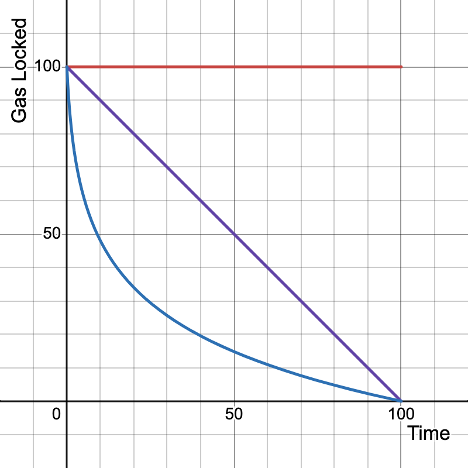

# Fee Elimination on Casper 2.0

Public distributed blockchain networks that support smart contract generally include a notion commonly known as "gas", which is acquired in finite quantities and used to meter and limit resource consumption by individual transactors. In such a model, a transactor's available gas is consumed by their usage of computation, data storage, and possibly other chain-specific resources. 

The public Casper Network and its testnet have used such a gas model from their genesis. Per deploy, transactors specify an amount of token to convert into gas at a 1:1 ratio, to be used to execute that deploy. All gas consumed in each block is allotted to the proposer of that block in the form of transaction fees. Also included in the model are tables to calculate gas costs and support for some portion of unconsumed gas to be refunded to transactors. 

This can be abstracted as payment, gas price, fee, and refund.

The `casper-node 2.0` reference implementation (aka Condor) has been augmented with the capability to support different options for payment, gas price, fee, and refund. 

-- some explanation here of the options --

-- We currently intend to launch 2.0 onto testnet and mainnet configured for fixed + dynamic gas price (1-3) + no-fee + no-refund  

--- a mention that gas limit = cost / gas price

Under this configuration profile, each kind of transaction has a fixed gas limit based upon its size and computational requirements. 
-- break out the kinds of transactions and their current base costs here

-- explanation of placing and removing `gas holds` on a users balance  (not 'locked' and 'unlocked' or 'returned')

--- `total balance` && `available balance` (not 'pending' and 'available')

--- available balance = total balance - sum(non expired holds)

--- we dont PERFORM transactions, we EXECUTE them

<!---
  this is as far as I got -ed
-->


## Design

The ultimate goal of any gas mechanism is to prevent exploitation of a network's resources. Aside from incentivizing validators, there is no fundamental reason to charge users for making transactions if their honesty can be guaranteed. By designing a system that disincentivizes wasteful transactions without charging a fee, resistance to exploitation can be maintained while allowing users to transact freely.

Casper 2.0 proposes the novel method of locking the tokens that would otherwise be spent on gas in the payers account for a specified duration. The duration of the locking period is defined [here](https://github.com/casper-network/casper-node/blob/feat-2.0/resources/production/chainspec.toml#L166) in the [casper-node](https://github.com/casper-network/casper-node) chainspec:

```toml
# If fee_handling is set to 'no_fee', the system places a balance hold on the payer
# equal to the value the fee would have been. Such balance holds expire after a time
# interval has elapsed. This setting controls how long that interval is. The available
# balance of a purse equals its total balance minus the held amount(s) of non-expired
# holds (see gas_hold_balance_handling setting for details of how that is calculated).
#
# For instance, if gas_hold_interval is 24 hours and 100 gas is used from a purse,
# a hold for 100 is placed on that purse and is considered when calculating total balance
# for 24 hours starting from the block_time when the hold was placed.
gas_hold_interval = '24 hours'
```

How the tokens are unlocked is also configurable. Currently implemented are `accrued` and `amortized`, as described below, however any function `f(t)` can be implemented to unlock tokens on a different schedule for optimal performance:

* **Accrued**<sub>red</sub>: $f(t) = n, \text{ where } n = \text{100\% gas locked}$
* **Amortized**<sub>purple</sub>: $f(t) = n - t, \text{ where } n = \text{100\% gas locked}$
* **Logarithmic**<sub>blue</sub>: $f(t) = n - \frac{n}{\ln(n+1)} \ln(t+1), \text{ where } n = \text{100\% gas locked}$



## Preventing Exploitation

It is intuitive to expect that a gas mechanism that doesn't charge users would be vulnerable to denial-of-service attacks. After all, provided a large enough bankroll, a user could deploy enough transactions to slow the network for the amount of time needed for his or her previous gas payments to unlock. In this way, one could simply deploy infinite transactions, cycling through their locked and unlocked balances. This is a well understood risk and must be avoided at all costs. Attacking the network in this way is a challenge of economic feasibility, much like many other aspects of blockchains. In proof-of-stake networks, owning enough of the total validator stake offers a similar malicious opportunity. To prevent an attack like this from taking place, it must be made to be prohibitively expensive, with little to no incentive to the attacker.

Casper's approach involves a long locking period combined with 8 second blocktimes (half the duration as in v1.5.6). The Casper 2.0 mainnet is slated to roll out with a 30 day locking period, but if increased, the cost to attack would scale linearly.

Considering a token locking period of 30 days and the **Accrued** unlocking schedule, purchasing just 1% of the total block space of each block would cost:

$\frac{T}{B} \cdot \frac{G}{100} = 10,692,000 \, \text{CSPR}$

Where:

* `T` = 30 day locking period
* `B` = 8 second blocktime
* `G` = 3300 CSPR block gas limit

If this proves to be too cheap, the locking period can be changed or the block gas limit increased.

## Incentivizing Validators

The Casper Network, like any true decentralized blockchain, allows miners to act in their greatest economic interest when it comes to validating transactions. The purpose of this is to incentivize validators as much as possible, as this encourages more to come online. Part of the income a validator earns comes from fees paid by a deployer, which entices validators to pick up their transactions. When no fee is paid by the deployer, however, an incentive must be provided to the validators.

Casper's solution is to make the validators whole, minting the tokens to them that they otherwise would have been paid.
